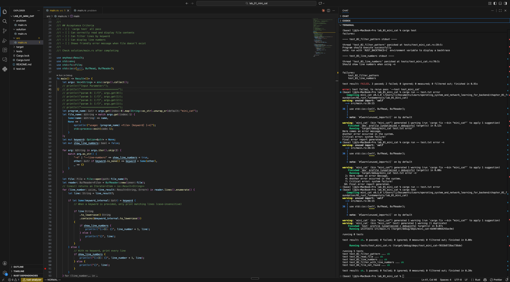

# OS & Network Learning for Backend

> Learn OS and Network fundamentals hands-on with Rust, building practical skills for backend development.

---

## Learning Objectives

After completing this course, you will be able to:

- **System Level**: Understand how programs run on OS (process, memory, I/O)
- **Network Level**: Understand TCP/HTTP/TLS mechanisms
- **Database Level**: Work with SQL databases and caching
- **Distributed Systems**: Implement common patterns (rate limiting, circuit breaker)
- **Practical Skills**: Write high-performance backend services and diagnose issues
- **Rust Proficiency**: Master Rust for systems programming and concurrency

## How to Use



---

## Course Structure

```
┌─────────────────────────────────────────────────────────────────┐
│  Chapter 1: Foundation                                          │
│  Rust Core + Linux Environment                                  │
├─────────────────────────────────────────────────────────────────┤
│  Chapter 2: OS                                                  │
│  Process / Thread / Memory / I/O                                │
├─────────────────────────────────────────────────────────────────┤
│  Chapter 3: Network                                             │
│  TCP / HTTP / TLS / Proxy                                       │
├─────────────────────────────────────────────────────────────────┤
│  Chapter 4: Database                                            │
│  SQL / Connection Pool / Caching / Redis                        │
├─────────────────────────────────────────────────────────────────┤
│  Chapter 5: Distributed Patterns                                │
│  Messaging / Rate Limiting / Circuit Breaker                    │
├─────────────────────────────────────────────────────────────────┤
│  Chapter 6: Capstone Project                                    │
│  REST Service + Observability + Performance                     │
└─────────────────────────────────────────────────────────────────┘
```

---

## Table of Contents

### [Chapter 1: Foundation](./chapter_01_foundation/)

**Goal**: Build foundational skills in Rust and Linux

| Topic        | Content                                                 | Labs                        |
| ------------ | ------------------------------------------------------- | --------------------------- |
| Rust Core    | Ownership, Borrowing, Error Handling, Arc/Mutex/Channel | Mini Cat/Grep, Parallel Sum |
| Linux Basics | Process, fd, syscall, /proc                             | strace Lab, Mini PS         |

### [Chapter 2: OS](./chapter_02_os/)

**Goal**: Deep understanding of OS resource management

| Topic            | Content                              | Labs                                      |
| ---------------- | ------------------------------------ | ----------------------------------------- |
| Process & Thread | fork/exec, context switch, scheduler | Process vs Thread comparison, Thread Pool |
| Memory           | Virtual memory, page fault, cache    | Locality experiment, Memory Pool          |
| I/O Model        | Blocking, non-blocking, epoll, async | Echo Server (three versions)              |

### [Chapter 3: Network](./chapter_03_network/)

**Goal**: Master network protocols and tools

| Topic       | Content                                      | Labs                                  |
| ----------- | -------------------------------------------- | ------------------------------------- |
| TCP/UDP     | Three-way handshake, flow control, TIME_WAIT | Chat Server, UDP Echo                 |
| HTTP        | Request/response, keep-alive, HTTP/2         | Handcrafted HTTP Server, Axum rewrite |
| TLS & Proxy | Handshake, certificates, reverse proxy       | HTTPS Server, Load Balancer           |

### [Chapter 4: Database](./chapter_04_database/)

**Goal**: Master database operations and caching

| Topic   | Content                                     | Labs                              |
| ------- | ------------------------------------------- | --------------------------------- |
| SQL     | SQLx, type-safe queries, connection pooling | CRUD Operations, Connection Pool  |
| Caching | Cache strategies, TTL, invalidation         | Redis Basics, Cache-Aside Pattern |

### [Chapter 5: Distributed Patterns](./chapter_05_distributed/)

**Goal**: Implement common distributed system patterns

| Topic      | Content                               | Labs                           |
| ---------- | ------------------------------------- | ------------------------------ |
| Messaging  | Channels, pub/sub, message queues     | Channel Patterns, Simple Queue |
| Resilience | Rate limiting, circuit breaker, retry | Token Bucket, Circuit Breaker  |

### [Chapter 6: Capstone Project](./chapter_06_project/)

**Goal**: Integrate all knowledge into a demonstrable project

| Topic         | Content                              | Labs                               |
| ------------- | ------------------------------------ | ---------------------------------- |
| REST Service  | JSON API, structured errors, logging | CRUD API with Axum, DB Integration |
| Observability | Tracing, Prometheus metrics          | Structured Logging, Metrics Export |
| Performance   | Load testing, analysis, tuning       | Custom Load Tester                 |

---

## Requirements

### Required

- **Rust** 1.70+ (recommended: install via [rustup](https://rustup.rs/))
- **Linux Environment** (any of):
  - Native Linux
  - WSL2 (Windows)
  - Docker
  - Cloud VM
  - (macOS note) Many labs assume Linux tools/`/proc`; on macOS, run them inside Docker/VM

### Recommended

- **Editor**: VS Code + rust-analyzer
- **Terminal Tools**: htop, strace, ss

### Installation Check

```bash
# Rust
rustc --version    # Should be >= 1.70
cargo --version

# Linux tools (run in Linux environment)
which strace htop ss
```

---

## How to Use This Course

### Learning Flow

```
1. Read theory.md              # Understand concepts
        ↓
2. Open Lab's src/main.rs      # See requirements
        ↓
3. Implement yourself          # Write code
        ↓
4. cargo test                  # Verify results
        ↓
5. Check solution/main.rs      # Compare with answer
        ↓
6. Use checkpoint.md           # Confirm understanding
```

### Lab Structure

Each Lab follows the "Problem → Solve → Verify → Compare" pattern:

```
lab_xx_name/
├── problem/
│   └── main.rs        ← Original problem (keep unchanged, copy back to src/ to redo)
├── src/
│   └── main.rs        ← Your workspace (write code here)
├── solution/
│   └── main.rs        ← Reference answer (check after completing)
├── tests/
│   └── test_xxx.rs    ← Automated tests (verify your implementation)
├── Cargo.toml
├── README.md          ← Detailed instructions
└── test.txt           ← Test data (if needed)
```

### Problem Format

Open `src/main.rs` and you'll see:

```rust
//! ## Goal
//! Implement a XXX tool
//!
//! ## Requirements
//! 1. Feature A
//! 2. Feature B
//!
//! ## Verification
//! cargo test
//!
//! ## Acceptance Criteria
//! - [ ] Criterion 1
//! - [ ] Criterion 2

fn main() {
    // TODO: Your implementation
}
```

### Verify Your Implementation

```bash
# Enter Lab directory
cd chapter_01_foundation/01_rust_fundamentals/lab_01_mini_cat

# 1. Run automated tests (most important!)
cargo test

# 2. Manual testing
cargo run -- test.txt
cargo run -- test.txt error
cargo run -- test.txt error -n

# 3. After tests pass, compare with reference answer
cat solution/main.rs
```

### Test Results

```bash
# All passed
running 5 tests
test test_01_read_file ... ok
test test_02_filter_pattern ... ok
test test_03_line_numbers ... ok
test test_04_file_not_found ... ok
test test_05_filter_with_line_numbers ... ok

# Some failed (keep working)
test test_02_filter_pattern ... FAILED
```

### Redo a Lab

Want to retry a Lab? Copy the original problem back to src/:

```bash
# Reset to original state
cp problem/main.rs src/main.rs

# Start fresh
cargo test  # Should fail since not implemented yet
```

---

## Learning Principles

### 1. Theory Must Connect to Practice

Every concept should be "visible". For example:

- Learned syscall → Use strace to see `open`, `read`, `write`
- Learned ownership → Use strace to see `close` called on drop

### 2. Handcraft First, Then Use Frameworks

- Handcraft HTTP server → Then use Axum
- Handwrite Thread Pool → Then use Rayon
- This way you understand what frameworks do for you

### 3. Observe System Behavior

Build habits of observing your programs with these tools:

- `htop`: CPU, memory, threads
- `strace`: System calls
- `ss`: Network connections
- `/proc`: Process state

---

## Progress Tracking

> Mark completed items with `[x]`!

### Chapter 1: Foundation

**1.1 Rust Core**

- [x] Read `01_rust_fundamentals/theory.md`
- [x] Complete Lab 1: Mini Cat/Grep
- [x] Complete Lab 2: Parallel Sum
- [x] Understand ownership, borrowing, lifetimes
- [x] Understand Arc/Mutex/Channel use cases

**1.2 Linux Basics**

- [x] Read `02_linux_basics/theory.md`
- [x] Complete Lab 3: strace observation
  - [x] Finish Readme
    - [x] 實作目標
    - [x] 環境準備
    - [x] 實驗一：觀察基本的檔案操作
    - [x] 實驗二：觀察多執行緒
    - [x] 實驗三：觀察網路操作
    - [x] 實驗四：效能分析
    - [x] 常見 System Call 對照表
    - [x] 驗收標準
    - [x] 延伸閱讀
  - [x] finish lab
  - [x] compare with solution
- [x] Complete Lab 4: Mini PS
  - [x] Read README and understand requirements
  - [x] Implementation
    - [x] List all PIDs by reading `/proc` directory
    - [x] Read `/proc/[pid]/cmdline` for command line
    - [x] Read `/proc/[pid]/status` for Name, State, PPid
    - [x] Extract VmRSS (memory usage) from status
    - [x] Handle processes that disappear during reading
    - [x] Format output as table (PID, PPID, STATE, MEMORY, COMMAND)
  - [x] Run `cargo test` and pass all tests
  - [x] Compare with solution
- [x] Can use strace to trace programs
- [x] Understand /proc virtual filesystem

**Chapter 1 Checkpoint**

- [ ] Complete `checkpoint.md` self-assessment
- [ ] Can explain "code ↔ syscall" correspondence

---

### Chapter 2: OS

**2.1 Process & Thread**

- [ ] Read theory
- [ ] Complete Lab 1: Process vs Thread comparison
  - [ ] Read README and understand requirements
  - [ ] Implementation
    - [ ] Implement `sum_with_processes(n, num_workers)` using `nix::unistd::fork()`
    - [ ] Implement IPC (pipes or unix sockets) for process communication
    - [ ] Implement `sum_with_threads(n, num_workers)` with thread spawn
    - [ ] Both versions produce correct parallel sum results
    - [ ] Run performance comparison showing execution time
  - [ ] Run `cargo test` and pass all tests
  - [ ] Compare with solution
- [ ] Complete Lab 2: Thread Pool
  - [ ] Read README and understand requirements
  - [ ] Implementation
    - [ ] Create `ThreadPool` struct with fixed number of workers
    - [ ] Workers wait for jobs using blocking receive (not busy-wait)
    - [ ] Implement `execute()` method to submit tasks
    - [ ] Jobs are `Box<dyn FnOnce() + Send + 'static>`
    - [ ] Use `mpsc::channel` to send jobs to workers
    - [ ] Use `Arc<Mutex<Receiver>>` to share receiver among workers
    - [ ] Implement graceful shutdown when pool is dropped
  - [ ] Run `cargo test` and pass all tests
  - [ ] Compare with solution

**2.2 Memory**

- [x] Read theory
- [ ] Complete Lab 3: Cache Locality
  - [ ] Read README and understand requirements
  - [ ] Implementation
    - [ ] Implement `sum_sequential(arr)` - sum in order (good locality)
    - [ ] Implement `sum_random(arr, indices)` - sum in random order (poor locality)
    - [ ] Implement `sum_row_major(arr)` - iterate 2D array row-first
    - [ ] Implement `sum_column_major(arr)` - iterate 2D array column-first
    - [ ] Use large arrays (10 million elements)
    - [ ] Run in release mode and measure performance
    - [ ] Verify sequential > random, row-major > column-major
  - [ ] Run `cargo test` and pass all tests
  - [ ] Compare with solution

**2.3 I/O Model**

- [ ] Read theory
- [ ] Complete Lab 4: Blocking Echo Server
  - [ ] Read README and understand requirements
  - [ ] Implementation
    - [ ] Listen on TCP port 8080
    - [ ] Accept incoming connections
    - [ ] Spawn a thread for each connection
    - [ ] Echo back whatever the client sends
    - [ ] Handle client disconnection gracefully (read returns 0)
    - [ ] Log connection and disconnection events
  - [ ] Run `cargo test` and pass all tests
  - [ ] Compare with solution
- [ ] Complete Lab 5: Async Echo Server
  - [ ] Read README and understand requirements
  - [ ] Implementation
    - [ ] Listen on TCP port 8080 asynchronously
    - [ ] Accept connections with `.await`
    - [ ] Spawn async task (not thread!) using `tokio::spawn`
    - [ ] Echo back data using `AsyncReadExt` and `AsyncWriteExt`
    - [ ] Handle client disconnection gracefully
    - [ ] Observe that thread count stays low with many connections
  - [ ] Run `cargo test` and pass all tests
  - [ ] Compare with solution

---

### Chapter 3: Network

**3.1 TCP/UDP**

- [ ] Read theory
- [ ] Complete Lab 1: TCP Chat Server
  - [ ] Read README and understand requirements
  - [ ] Implementation
    - [ ] Listen on TCP port 8080
    - [ ] Accept multiple clients concurrently
    - [ ] Broadcast message to all other connected clients
    - [ ] Handle client disconnection gracefully
    - [ ] Show connection/disconnection notifications
    - [ ] Use `tokio::sync::broadcast` or `Arc<Mutex<HashMap>>` for shared state
    - [ ] Each client has unique ID
  - [ ] Run `cargo test` and pass all tests
  - [ ] Compare with solution
- [ ] Complete Lab 2: UDP Echo Server
  - [ ] Read README and understand requirements
  - [ ] Implementation
    - [ ] Listen on UDP port 8080
    - [ ] Receive datagrams using `recv_from()`
    - [ ] Echo each datagram back using `send_to()`
    - [ ] Print statistics (packets received, bytes processed)
    - [ ] Use `AtomicU64` for counters
    - [ ] Understand difference from TCP (no connection, per-datagram)
  - [ ] Run `cargo test` and pass all tests
  - [ ] Compare with solution
- [ ] Use tcpdump/Wireshark to observe packets

**3.2 HTTP**

- [ ] Read theory
- [ ] Complete Lab 3: Raw HTTP Server
  - [ ] Read README and understand requirements
  - [ ] Implementation
    - [ ] Listen on port 8080
    - [ ] Parse HTTP requests manually (request line, headers, body)
    - [ ] Route based on method and path
    - [ ] Implement `GET /` → "Hello, World!"
    - [ ] Implement `GET /hello/{name}` → "Hello, {name}!"
    - [ ] Implement `GET /time` → current time
    - [ ] Implement 404 Not Found for other routes
    - [ ] Return proper HTTP responses with headers (CRLF `\r\n`)
  - [ ] Run `cargo test` and pass all tests
  - [ ] Compare with solution
- [ ] Complete Lab 4: Axum REST API
  - [ ] Read README and understand requirements
  - [ ] Implementation
    - [ ] Store items in `Arc<Mutex<HashMap>>`
    - [ ] Implement `GET /items` - List all items
    - [ ] Implement `POST /items` - Create new item (returns 201)
    - [ ] Implement `GET /items/:id` - Get single item (returns 404 if not found)
    - [ ] Implement `PUT /items/:id` - Update item
    - [ ] Implement `DELETE /items/:id` - Delete item
    - [ ] Return proper JSON responses with appropriate status codes
    - [ ] Handle concurrent requests safely
  - [ ] Run `cargo test` and pass all tests
  - [ ] Compare with solution

**3.3 TLS & Proxy**

- [ ] Read theory
- [ ] Complete Lab 5: Reverse Proxy
  - [ ] Read README and understand requirements
  - [ ] Implementation
    - [ ] Listen on port 8080
    - [ ] Forward requests to multiple backend servers
    - [ ] Implement round-robin load balancing using `AtomicUsize`
    - [ ] Add `X-Forwarded-For` header
    - [ ] Handle backend failures gracefully (don't crash proxy)
    - [ ] Read HTTP request, connect to backend, forward request and response
  - [ ] Run `cargo test` and pass all tests
  - [ ] Compare with solution

---

### Chapter 4: Database

**4.1 SQL**

- [ ] Read theory
- [ ] Complete Lab 1: SQLx CRUD
  - [ ] Read README and understand requirements
  - [ ] Implementation
    - [ ] Create User table with id, name, email fields
    - [ ] Implement `init_db()` - create table on startup
    - [ ] Implement `create_user()` - insert new user
    - [ ] Implement `get_user(id)` - read user by ID
    - [ ] Implement `list_users()` - get all users
    - [ ] Implement `update_user(id, name)` - update user
    - [ ] Implement `delete_user(id)` - delete user
    - [ ] Use SQLx query macros for type safety
    - [ ] Use `SqlitePool` for connection pool
  - [ ] Run `cargo test` and pass all tests
  - [ ] Compare with solution
- [ ] Complete Lab 2: Connection Pool Behavior
  - [ ] Read README and understand requirements
  - [ ] Implementation
    - [ ] Create pool with configurable size (test 2, 5, 10)
    - [ ] Simulate concurrent database queries using `tokio::spawn`
    - [ ] Implement `slow_query()` with artificial delay
    - [ ] Implement `run_concurrent_queries()` - spawn N concurrent queries
    - [ ] Measure query latency with different pool sizes
    - [ ] Calculate statistics: min, max, average, p95 latency
    - [ ] Observe that queries wait when pool is exhausted
  - [ ] Run `cargo test` and pass all tests
  - [ ] Compare with solution

**4.2 Caching**

- [ ] Read theory
- [ ] Complete Lab 3: Redis Basics
  - [ ] Read README and understand requirements
  - [ ] Implementation
    - [ ] Connect to Redis server
    - [ ] Implement `demo_strings()` - GET, SET, DEL operations
    - [ ] Implement `demo_ttl()` - SET with expiration, check TTL
    - [ ] Implement `demo_hash()` - HSET, HGET, HGETALL operations
    - [ ] Implement `demo_list()` - LPUSH, RPOP, LRANGE operations
    - [ ] Use async connection with `redis::AsyncCommands`
  - [ ] Run `cargo test` and pass all tests
  - [ ] Compare with solution
- [ ] Complete Lab 4: Cache Patterns
  - [ ] Read README and understand requirements
  - [ ] Implementation
    - [ ] Implement cache-aside pattern
    - [ ] Support TTL (expiration) using `Instant` for timestamps
    - [ ] Handle cache misses by fetching from "database"
    - [ ] Implement `Cache::get()` - check expiration, update stats
    - [ ] Implement `Cache::set()` - store with TTL
    - [ ] Implement `get_user_cached()` - cache first, fallback to database
    - [ ] Track cache hit/miss statistics with `CacheStats`
    - [ ] Calculate and display hit rate
  - [ ] Run `cargo test` and pass all tests
  - [ ] Compare with solution

---

### Chapter 5: Distributed Patterns

**5.1 Messaging**

- [ ] Read theory
- [ ] Complete Lab 1: Channel Patterns
  - [ ] Read README and understand requirements
  - [ ] Implementation
    - [ ] Implement `demo_fan_in()` - multiple producers → single consumer (`mpsc`)
    - [ ] Implement `demo_fan_out()` - single producer → multiple consumers (`broadcast`)
    - [ ] Implement `demo_worker_pool()` - distribute jobs across workers sharing receiver
    - [ ] Handle graceful shutdown (no hanging)
    - [ ] Show proper use of channel cloning and dropping
  - [ ] Run `cargo test` and pass all tests
  - [ ] Compare with solution
- [ ] Complete Lab 2: Simple Message Queue
  - [ ] Read README and understand requirements
  - [ ] Implementation
    - [ ] Implement `Queue` struct with pending and processing queues
    - [ ] Implement `enqueue(payload)` - add message with UUID
    - [ ] Implement `dequeue()` - get next message, move to processing
    - [ ] Implement `acknowledge(id)` - remove from processing
    - [ ] Implement `check_timeouts()` - redeliver unacknowledged messages
    - [ ] Track message attempts
    - [ ] Demonstrate unacked messages are redelivered
  - [ ] Run `cargo test` and pass all tests
  - [ ] Compare with solution

**5.2 Resilience Patterns**

- [ ] Read theory
- [ ] Complete Lab 3: Rate Limiter
  - [ ] Read README and understand requirements
  - [ ] Implementation
    - [ ] Implement `RateLimiter::new(capacity, refill_rate)`
    - [ ] Implement `refill()` - calculate elapsed time, add tokens (don't exceed capacity)
    - [ ] Implement `allow()` - check if request allowed, consume 1 token
    - [ ] Implement `allow_n(n)` - consume n tokens for batch requests
    - [ ] Track tokens as f64 for partial refills
    - [ ] Demonstrate burst behavior and refill over time
  - [ ] Run `cargo test` and pass all tests
  - [ ] Compare with solution
- [ ] Complete Lab 4: Circuit Breaker
  - [ ] Read README and understand requirements
  - [ ] Implementation
    - [ ] Three states: Closed, Open, HalfOpen
    - [ ] Track consecutive failures with configurable threshold
    - [ ] Open circuit after N consecutive failures
    - [ ] Transition to HalfOpen after reset timeout
    - [ ] In HalfOpen: success closes, failure opens
    - [ ] Implement `call(f)` - execute function through circuit breaker
    - [ ] Return `CircuitError::Open` when circuit is open
    - [ ] Implement `on_success()` and `on_failure()` handlers
  - [ ] Run `cargo test` and pass all tests
  - [ ] Compare with solution

---

### Chapter 6: Capstone Project

**6.1 REST Service**

- [ ] Read theory
- [ ] Complete Lab 1: Axum CRUD with UUID
  - [ ] Read README and understand requirements
  - [ ] Implementation
    - [ ] Data model: `Item { id: Uuid, name, description, price, created_at }`
    - [ ] Use `Arc<RwLock<HashMap<Uuid, Item>>>` for shared state
    - [ ] Implement `POST /items` - Create (returns 201)
    - [ ] Implement `GET /items/:id` - Get by ID (returns 404 if not found)
    - [ ] Implement `GET /items` - List with pagination (`?page=1&limit=10`)
    - [ ] Implement `PUT /items/:id` - Update (partial updates with `Option<T>`)
    - [ ] Implement `DELETE /items/:id` - Delete (returns 204)
    - [ ] Implement proper error responses with `AppError` enum
  - [ ] Run `cargo test` and pass all tests
  - [ ] Compare with solution
- [ ] Complete Lab 2: Database Integration
  - [ ] Read README and understand requirements
  - [ ] Implementation
    - [ ] Initialize SQLite database with schema on startup
    - [ ] Database schema: items table (id TEXT, name, description, price, created_at)
    - [ ] Store UUID as TEXT in SQLite
    - [ ] Implement `init_db(pool)` - create table if not exists
    - [ ] Update all handlers to use SQLx database queries
    - [ ] Implement pagination with COUNT and LIMIT/OFFSET
    - [ ] Use connection pool via Axum State
    - [ ] Handle database errors with proper conversion to `AppError`
  - [ ] Run `cargo test` and pass all tests
  - [ ] Compare with solution

**6.2 Observability**

- [ ] Read theory
- [ ] Complete Lab 3: Structured Logging (Tracing)
  - [ ] Read README and understand requirements
  - [ ] Implementation
    - [ ] Initialize tracing subscriber with JSON output
    - [ ] Generate unique request ID (UUID) for each request
    - [ ] Create request span with method, path, request_id
    - [ ] Log request start and completion with duration (ms)
    - [ ] Implement `logging_middleware` that creates spans and logs
    - [ ] Use appropriate log levels (info, warn, error)
    - [ ] Use `#[instrument]` attribute for automatic span creation
    - [ ] Output JSON format with timestamp, level, request_id, method, path
  - [ ] Run `cargo test` and pass all tests
  - [ ] Compare with solution
- [ ] Complete Lab 4: Prometheus Metrics
  - [ ] Read README and understand requirements
  - [ ] Implementation
    - [ ] Create `http_requests_total` (CounterVec) with labels [method, path, status]
    - [ ] Create `http_request_duration_seconds` (HistogramVec) with labels [method, path]
    - [ ] Implement `Metrics` struct with Registry
    - [ ] Implement `metrics_middleware` that records metrics for every request
    - [ ] Implement `/metrics` endpoint returning Prometheus text format
    - [ ] Histogram buckets: [0.001, 0.005, 0.01, 0.025, 0.05, 0.1, 0.25, 0.5, 1.0]
    - [ ] Increment counter after request completes
    - [ ] Observe duration for histogram
  - [ ] Run `cargo test` and pass all tests
  - [ ] Compare with solution

**6.3 Performance**

- [ ] Read theory
- [ ] Complete Lab 5: Load Testing Tool
  - [ ] Read README and understand requirements
  - [ ] Implementation
    - [ ] Accept CLI arguments: `--url`, `--concurrency`, `--duration`
    - [ ] Create HTTP client and shared `Stats` struct
    - [ ] Spawn N concurrent worker tasks using `tokio::spawn`
    - [ ] Each worker loops until duration expires, making HTTP GET requests
    - [ ] Measure latency for each request using `Instant`
    - [ ] Record success/failure with `AtomicU64` counters
    - [ ] Collect all latencies in `Mutex<Vec<Duration>>`
    - [ ] Calculate total requests, success/failed count
    - [ ] Calculate requests per second (throughput)
    - [ ] Calculate latency percentiles (p50, p95, p99)
    - [ ] Calculate min/max/average latency
    - [ ] Sort latencies for percentile calculation
  - [ ] Run `cargo test` and pass all tests
  - [ ] Compare with solution
- [ ] Document performance analysis

---

### Overall Progress

| Chapter                | Status       | Completion Date |
| ---------------------- | ------------ | --------------- |
| Chapter 1: Foundation  | ✅ Available |                 |
| Chapter 2: OS          | ✅ Available |                 |
| Chapter 3: Network     | ✅ Available |                 |
| Chapter 4: Database    | ✅ Available |                 |
| Chapter 5: Distributed | ✅ Available |                 |
| Chapter 6: Capstone    | ✅ Available |                 |

---

## References

### Books

- [The Rust Programming Language](https://doc.rust-lang.org/book/)
- [Rust by Example](https://doc.rust-lang.org/rust-by-example/)
- [Linux System Programming](https://www.oreilly.com/library/view/linux-system-programming/9781449341527/)

### Online Resources

- [Tokio Tutorial](https://tokio.rs/tokio/tutorial)
- [Beej's Guide to Network Programming](https://beej.us/guide/bgnet/)

### Tool Documentation

- `man strace`
- `man proc`
- `man 2 syscalls`

---

## License

This course material is for personal learning only.
