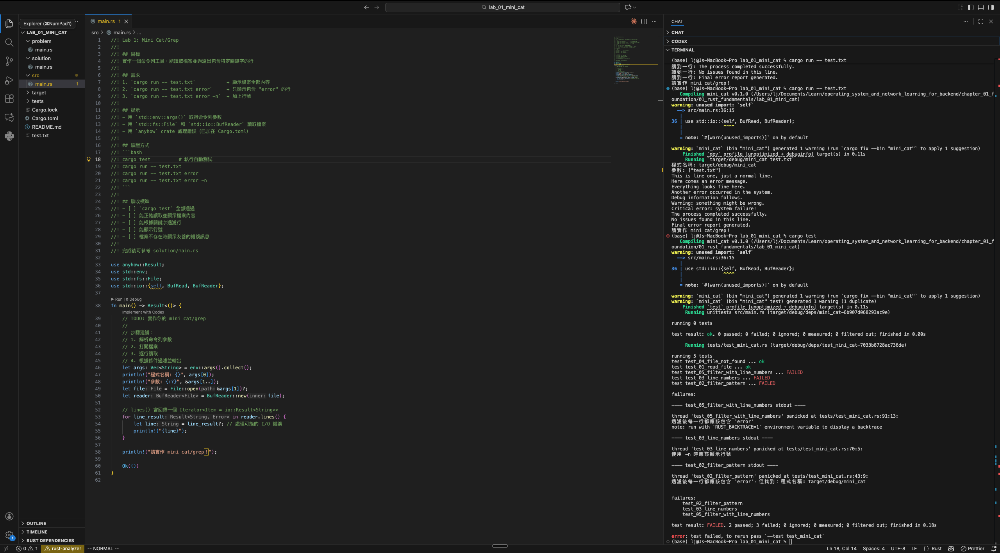

# OS & Network Learning for Backend

> Learn OS and Network fundamentals hands-on with Rust, building practical skills for backend development.

---

## Learning Objectives

After completing this course, you will be able to:

- **System Level**: Understand how programs run on OS (process, memory, I/O)
- **Network Level**: Understand TCP/HTTP/TLS mechanisms
- **Practical Skills**: Write high-performance backend services and diagnose issues
- **Rust Proficiency**: Master Rust for systems programming and concurrency

## How to Use



---

## Course Structure

```
┌─────────────────────────────────────────────────────────────────┐
│  Chapter 1: Foundation                                          │
│  Rust Core + Linux Environment                                  │
├─────────────────────────────────────────────────────────────────┤
│  Chapter 2: OS                                                  │
│  Process / Thread / Memory / I/O                                │
├─────────────────────────────────────────────────────────────────┤
│  Chapter 3: Network                                             │
│  TCP / HTTP / TLS / Proxy                                       │
├─────────────────────────────────────────────────────────────────┤
│  Chapter 4: Capstone Project                                    │
│  REST Service + Observability + Tuning                          │
└─────────────────────────────────────────────────────────────────┘
```

---

## Table of Contents

### [Chapter 1: Foundation](./chapter_01_foundation/)

**Goal**: Build foundational skills in Rust and Linux

| Topic        | Content                                                 | Labs                        |
| ------------ | ------------------------------------------------------- | --------------------------- |
| Rust Core    | Ownership, Borrowing, Error Handling, Arc/Mutex/Channel | Mini Cat/Grep, Parallel Sum |
| Linux Basics | Process, fd, syscall, /proc                             | strace Lab, Mini PS         |

### Chapter 2: OS (Planned)

**Goal**: Deep understanding of OS resource management

| Topic            | Content                              | Labs                                      |
| ---------------- | ------------------------------------ | ----------------------------------------- |
| Process & Thread | fork/exec, context switch, scheduler | Process vs Thread comparison, Thread Pool |
| Memory           | Virtual memory, page fault, cache    | Locality experiment, Memory Pool          |
| I/O Model        | Blocking, non-blocking, epoll, async | Echo Server (three versions)              |

### Chapter 3: Network (Planned)

**Goal**: Master network protocols and tools

| Topic       | Content                                      | Labs                                  |
| ----------- | -------------------------------------------- | ------------------------------------- |
| TCP/UDP     | Three-way handshake, flow control, TIME_WAIT | Chat Server, UDP Echo                 |
| HTTP        | Request/response, keep-alive, HTTP/2         | Handcrafted HTTP Server, Axum rewrite |
| TLS & Proxy | Handshake, certificates, reverse proxy       | HTTPS Server, Load Balancer           |

### Chapter 4: Capstone Project (Planned)

**Goal**: Integrate all knowledge into a demonstrable project

| Topic         | Content                              | Labs                               |
| ------------- | ------------------------------------ | ---------------------------------- |
| REST Service  | JSON API, structured errors, logging | CRUD API with Axum                 |
| Observability | Tracing, Prometheus metrics          | Add /metrics endpoint              |
| Tuning        | Load testing, analysis, tuning       | wrk testing + htop/strace analysis |

---

## Requirements

### Required

- **Rust** 1.70+ (recommended: install via [rustup](https://rustup.rs/))
- **Linux Environment** (any of):
  - Native Linux
  - WSL2 (Windows)
  - Docker
  - Cloud VM

### Recommended

- **Editor**: VS Code + rust-analyzer
- **Terminal Tools**: htop, strace, ss

### Installation Check

```bash
# Rust
rustc --version    # Should be >= 1.70
cargo --version

# Linux tools (run in Linux environment)
which strace htop ss
```

---

## How to Use This Course

### Learning Flow

```
1. Read theory.md              # Understand concepts
        ↓
2. Open Lab's src/main.rs      # See requirements
        ↓
3. Implement yourself          # Write code
        ↓
4. cargo test                  # Verify results
        ↓
5. Check solution/main.rs      # Compare with answer
        ↓
6. Use checkpoint.md           # Confirm understanding
```

### Lab Structure

Each Lab follows the "Problem → Solve → Verify → Compare" pattern:

```
lab_xx_name/
├── problem/
│   └── main.rs        ← Original problem (keep unchanged, copy back to src/ to redo)
├── src/
│   └── main.rs        ← Your workspace (write code here)
├── solution/
│   └── main.rs        ← Reference answer (check after completing)
├── tests/
│   └── test_xxx.rs    ← Automated tests (verify your implementation)
├── Cargo.toml
├── README.md          ← Detailed instructions
└── test.txt           ← Test data (if needed)
```

### Problem Format

Open `src/main.rs` and you'll see:

```rust
//! ## Goal
//! Implement a XXX tool
//!
//! ## Requirements
//! 1. Feature A
//! 2. Feature B
//!
//! ## Verification
//! cargo test
//!
//! ## Acceptance Criteria
//! - [ ] Criterion 1
//! - [ ] Criterion 2

fn main() {
    // TODO: Your implementation
}
```

### Verify Your Implementation

```bash
# Enter Lab directory
cd chapter_01_foundation/01_rust_fundamentals/lab_01_mini_cat

# 1. Run automated tests (most important!)
cargo test

# 2. Manual testing
cargo run -- test.txt
cargo run -- test.txt error
cargo run -- test.txt error -n

# 3. After tests pass, compare with reference answer
cat solution/main.rs
```

### Test Results

```bash
# All passed
running 5 tests
test test_01_read_file ... ok
test test_02_filter_pattern ... ok
test test_03_line_numbers ... ok
test test_04_file_not_found ... ok
test test_05_filter_with_line_numbers ... ok

# Some failed (keep working)
test test_02_filter_pattern ... FAILED
```

### Redo a Lab

Want to retry a Lab? Copy the original problem back to src/:

```bash
# Reset to original state
cp problem/main.rs src/main.rs

# Start fresh
cargo test  # Should fail since not implemented yet
```

---

## Learning Principles

### 1. Theory Must Connect to Practice

Every concept should be "visible". For example:

- Learned syscall → Use strace to see `open`, `read`, `write`
- Learned ownership → Use strace to see `close` called on drop

### 2. Handcraft First, Then Use Frameworks

- Handcraft HTTP server → Then use Axum
- Handwrite Thread Pool → Then use Rayon
- This way you understand what frameworks do for you

### 3. Observe System Behavior

Build habits of observing your programs with these tools:

- `htop`: CPU, memory, threads
- `strace`: System calls
- `ss`: Network connections
- `/proc`: Process state

---

## Progress Tracking

> Mark completed items with `[x]`!

### Chapter 1: Foundation

**1.1 Rust Core**

- [x] Read `01_rust_fundamentals/theory.md`
- [ ] Complete Lab 1: Mini Cat/Grep
- [ ] Complete Lab 2: Parallel Sum
- [ ] Understand ownership, borrowing, lifetimes
- [ ] Understand Arc/Mutex/Channel use cases

**1.2 Linux Basics**

- [ ] Read `02_linux_basics/theory.md`
- [ ] Complete Lab 3: strace observation
- [ ] Complete Lab 4: Mini PS
- [ ] Can use strace to trace programs
- [ ] Understand /proc virtual filesystem

**Chapter 1 Checkpoint**

- [ ] Complete `checkpoint.md` self-assessment
- [ ] Can explain "code ↔ syscall" correspondence

---

### Chapter 2: OS (Planned)

**2.1 Process & Thread**

- [ ] Read theory
- [ ] Complete Lab: Process vs Thread comparison
- [ ] Complete Lab: Thread Pool

**2.2 Memory**

- [ ] Read theory
- [ ] Complete Lab: Locality experiment
- [ ] Complete Lab: Memory Pool

**2.3 I/O Model**

- [ ] Read theory
- [ ] Complete Lab: Blocking Echo Server
- [ ] Complete Lab: Non-blocking (mio) Echo Server
- [ ] Complete Lab: Async (Tokio) Echo Server

---

### Chapter 3: Network (Planned)

**3.1 TCP/UDP**

- [ ] Read theory
- [ ] Complete Lab: TCP Chat Server
- [ ] Complete Lab: UDP Echo
- [ ] Use tcpdump/Wireshark to observe packets

**3.2 HTTP**

- [ ] Read theory
- [ ] Complete Lab: Handcrafted HTTP Server
- [ ] Complete Lab: Axum rewrite

**3.3 TLS & Proxy**

- [ ] Read theory
- [ ] Complete Lab: HTTPS Server
- [ ] Complete Lab: Reverse Proxy
- [ ] Complete Lab: Load Balancer

---

### Chapter 4: Capstone Project (Planned)

**4.1 REST Service**

- [ ] Implement CRUD API
- [ ] Add structured error handling
- [ ] Add logging (tracing)

**4.2 Observability**

- [ ] Add Prometheus metrics
- [ ] Expose /metrics endpoint

**4.3 Tuning**

- [ ] Load test with wrk
- [ ] Analyze with htop/strace
- [ ] Document tuning conclusions

---

### Overall Progress

| Chapter               | Status         | Completion Date |
| --------------------- | -------------- | --------------- |
| Chapter 1: Foundation | 🔄 In Progress |                 |
| Chapter 2: OS         | ⏳ Pending     |                 |
| Chapter 3: Network    | ⏳ Pending     |                 |
| Chapter 4: Capstone   | ⏳ Pending     |                 |

---

## References

### Books

- [The Rust Programming Language](https://doc.rust-lang.org/book/)
- [Rust by Example](https://doc.rust-lang.org/rust-by-example/)
- [Linux System Programming](https://www.oreilly.com/library/view/linux-system-programming/9781449341527/)

### Online Resources

- [Tokio Tutorial](https://tokio.rs/tokio/tutorial)
- [Beej's Guide to Network Programming](https://beej.us/guide/bgnet/)

### Tool Documentation

- `man strace`
- `man proc`
- `man 2 syscalls`

---

## License

This course material is for personal learning only.
